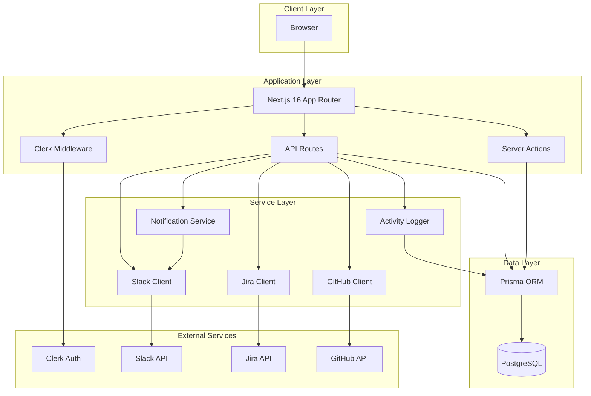
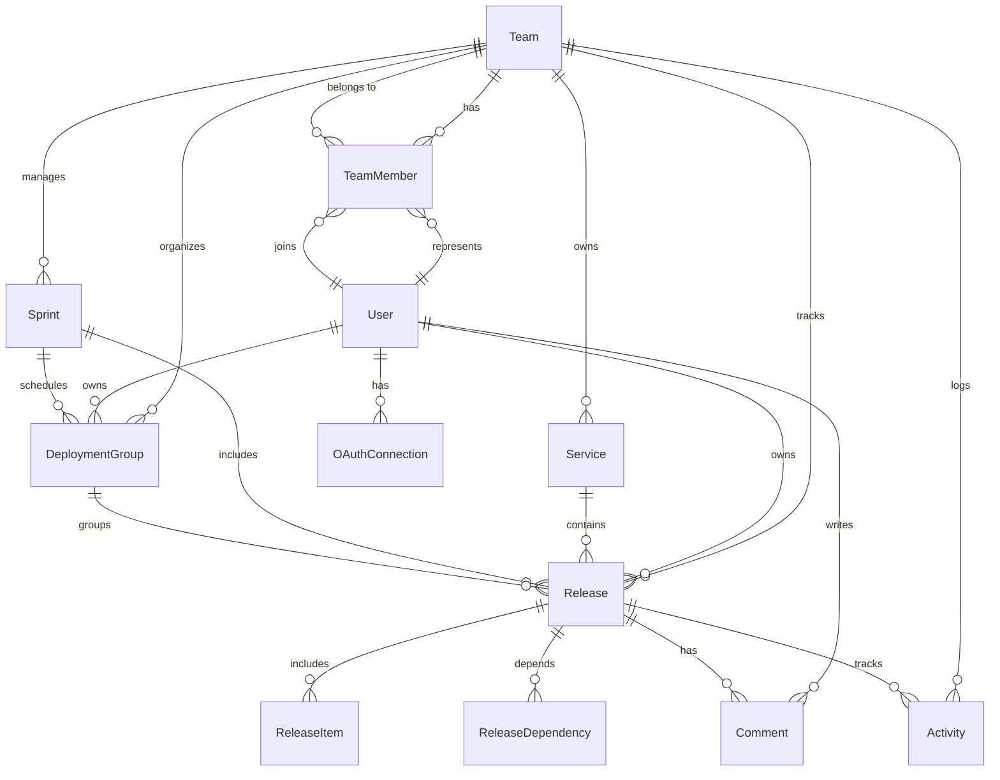
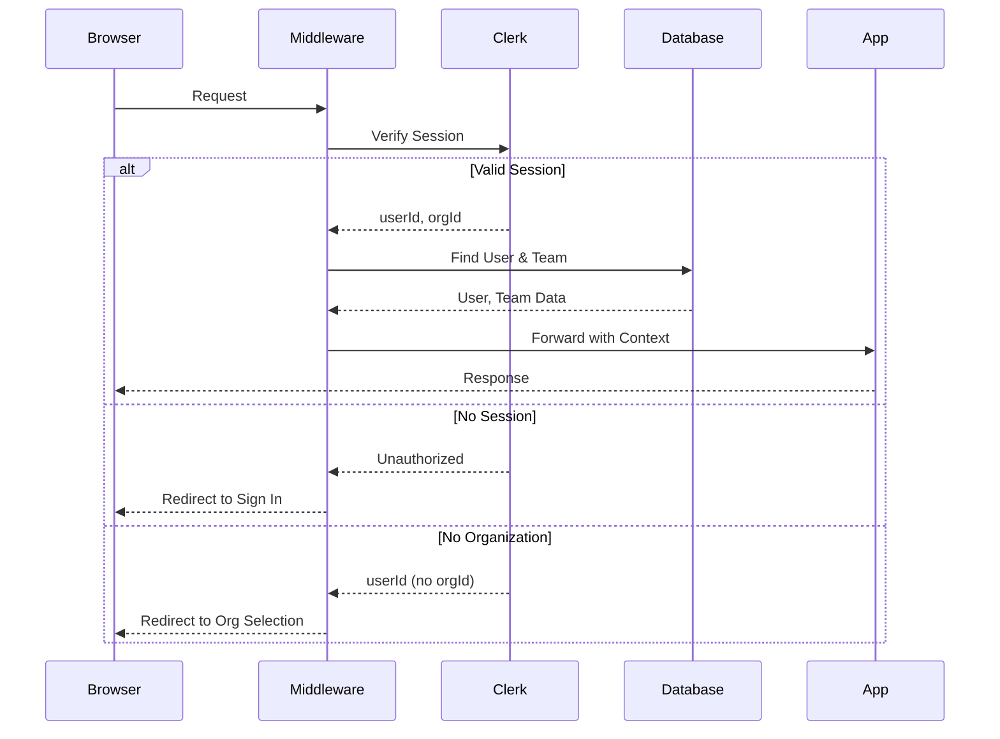
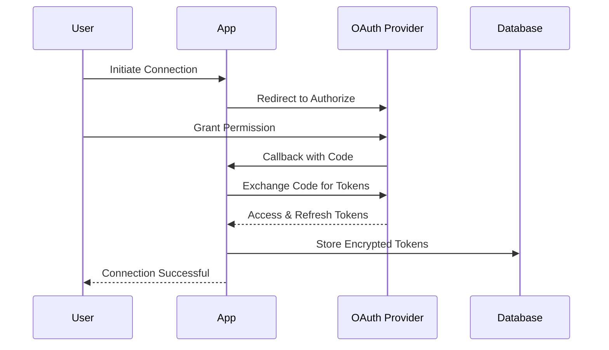
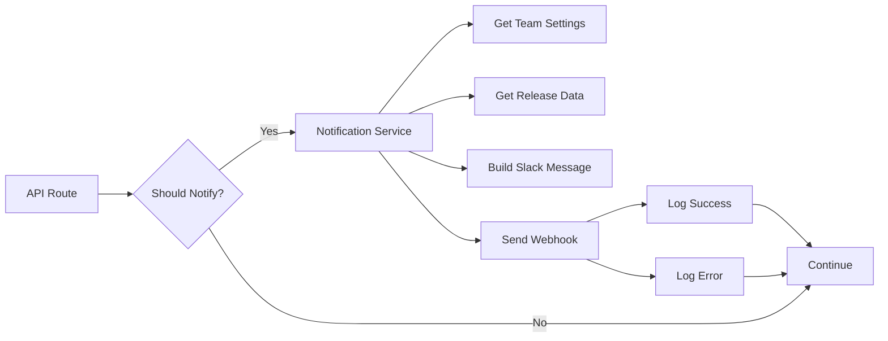

# System Architecture

This document provides a comprehensive overview of the Release Coordinator system architecture, including data models, authentication flows, API design, and integration patterns.

## Table of Contents

- [High-Level Architecture](#high-level-architecture)
- [Technology Stack](#technology-stack)
- [Data Model](#data-model)
- [Authentication & Authorization](#authentication--authorization)
- [API Architecture](#api-architecture)
- [Integration Patterns](#integration-patterns)
- [Notification System](#notification-system)
- [Activity Logging](#activity-logging)
- [Key Design Decisions](#key-design-decisions)

## High-Level Architecture



### System Layers

1. **Client Layer**: React-based frontend using Next.js App Router with server-side rendering
2. **Application Layer**: Next.js handles routing, middleware, and request processing
3. **Service Layer**: Encapsulates business logic and external integrations
4. **Data Layer**: Prisma ORM provides type-safe database access to PostgreSQL

## Technology Stack

### Core Framework
- **Next.js 16**: React framework with App Router, Server Components, and API Routes
- **React 19**: UI library with hooks and server components
- **TypeScript 5**: Type-safe development

### Authentication & Authorization
- **Clerk**: Multi-tenant authentication with organization support
- **Middleware-based protection**: Route-level authentication and organization context

### Database & ORM
- **PostgreSQL**: Primary database
- **Prisma 5**: Type-safe ORM with schema migrations

### UI Components
- **Radix UI**: Accessible component primitives
- **Tailwind CSS 4**: Utility-first styling
- **Lucide React**: Icon library
- **next-themes**: Dark mode support

### State Management & Data Fetching
- **TanStack Query (React Query)**: Server state management
- **React Hooks**: Local state management

### Integrations
- **Jira API**: OAuth 2.0 for ticket management
- **GitHub API**: OAuth for PR tracking
- **Slack API**: Webhooks for notifications

### Testing
- **Vitest**: Unit and integration testing
- **Testing Library**: Component testing
- **MSW**: API mocking

## Data Model

### Core Entity Relationships



### Key Entities

#### Team
Multi-tenant root entity representing an organization. Each team:
- Maps to a Clerk organization via `clerkOrgId`
- Owns all releases, services, sprints, and deployment groups
- Configures Slack notifications (webhook URL, channel, preferences)
- Has members with roles (OWNER, ADMIN, MEMBER, VIEWER)

#### User
Individual user entity synchronized with Clerk:
- Linked via `clerkUserId`
- Can belong to multiple teams with different roles
- Owns OAuth connections for Jira and GitHub
- Can own releases and deployment groups

#### Service
Represents a deployable service or application:
- Associated with a GitHub repository (optional)
- Linked to Jira project (optional)
- Has multiple releases over time
- Identified by team-scoped slug

#### Release
Core entity tracking a deployable release:
- Belongs to a service and team
- Has status progression from PLANNING → DEPLOYED
- Can be part of a sprint and/or deployment group
- Tracks Jira tickets and GitHub PRs as release items
- Supports dependencies between releases
- Has priority levels (LOW, MEDIUM, HIGH, CRITICAL)
- Tracks deployment timestamps (staging, production)

#### Sprint
Time-boxed iteration for organizing releases:
- Has start/end dates
- Contains multiple releases
- Status: PLANNING, ACTIVE, COMPLETED, CANCELLED

#### DeploymentGroup
Coordinates related releases for deployment:
- Groups releases that should deploy together
- Supports sequential or simultaneous deployment order
- Can be sprint-scoped or standalone
- Has owner and target date

#### ReleaseItem
Links external work items to releases:
- JIRA_TICKET: Jira issues via OAuth
- GITHUB_PR: Pull requests via OAuth
- Caches title, status, assignee
- Supports sync with external systems

#### ReleaseDependency
Models dependencies between releases:
- BLOCKS: Hard blocking dependency
- SOFT_DEPENDENCY: Informational dependency
- REQUIRES_SYNC: Must deploy together

#### OAuthConnection
Stores encrypted OAuth tokens:
- Provider-specific (JIRA or GITHUB)
- User-scoped
- Supports token refresh
- Tracks validity and errors
- Stores provider-specific metadata (cloudId for Jira)

### Data Model Characteristics

1. **Multi-tenancy**: All core entities are team-scoped via `teamId`
2. **Cascade Deletes**: Most relations use `CASCADE` for automatic cleanup of related records
3. **Optimistic Indexes**: Strategic indexes on foreign keys and query patterns
4. **Audit Trail**: Activity entity tracks all significant changes
5. **CUID Identifiers**: Collision-resistant unique IDs for all entities

## Authentication & Authorization

### Authentication Flow (Clerk)



### Middleware Protection

The `src/middleware.ts` implements route-based protection:

```typescript
// Public routes - no authentication required
- "/" (landing page)
- "/sign-in", "/sign-up"
- "/invite/*" (team invitations)
- "/api/webhooks/*" (Clerk webhooks)
- "/api/invitations/*" (invitation acceptance)

// Protected routes - require authentication
- All other routes require valid userId

// Organization-scoped routes - require orgId
- "/board", "/releases", "/services", "/sprints"
- "/deployment-groups", "/settings"
- Redirects to "/select-org" if no organization selected
```

### Authorization Pattern

```typescript
// Helper functions in src/lib/auth.ts
getCurrentUser() // Returns User from Clerk userId
getCurrentTeam() // Returns Team from Clerk orgId
requireUser() // Throws if no authenticated user
requireTeam() // Throws if no organization selected
```

API routes use these helpers to ensure:
1. User is authenticated
2. Organization context is available
3. User belongs to the requested team
4. User has appropriate role for the operation

### Multi-tenant Isolation

All database queries include `teamId` filter:

```typescript
// Example: Fetching releases is automatically team-scoped
const team = await requireTeam();
const releases = await prisma.release.findMany({
  where: { teamId: team.id }
});
```

### Webhook Synchronization

Clerk webhooks (`/api/webhooks/clerk`) synchronize:
- User creation/updates
- Organization creation
- Membership changes

This keeps the local database in sync with Clerk's state.

## API Architecture

### Route Structure

```
/api
├── /dashboard
│   └── /stats                    # Dashboard statistics
├── /releases
│   ├── GET, POST                 # List and create releases
│   └── /[id]
│       ├── GET, PATCH, DELETE    # Release operations
│       ├── /activities           # Activity feed
│       ├── /comments             # Comments on release
│       ├── /dependencies         # Release dependencies
│       └── /items                # Jira tickets & GitHub PRs
├── /services
│   ├── GET, POST                 # List and create services
│   └── /[id]                     # Update and delete service
├── /sprints
│   ├── GET, POST                 # List and create sprints
│   └── /[id]                     # Update and delete sprint
├── /deployment-groups
│   ├── GET, POST                 # List and create groups
│   └── /[id]                     # Update and delete group
│       └── /releases             # Releases in group
├── /oauth
│   ├── /connections              # List OAuth connections
│   ├── /jira
│   │   ├── /authorize            # Start OAuth flow
│   │   └── /callback             # OAuth callback
│   └── /github
│       ├── /authorize            # Start OAuth flow
│       └── /callback             # OAuth callback
├── /integrations
│   ├── /jira/search              # Search Jira issues
│   └── /github/search            # Search GitHub PRs
├── /team
│   ├── /settings                 # Team configuration
│   │   └── /test-slack           # Test Slack webhook
│   └── /invitations              # Team invitations
└── /webhooks
    └── /clerk                    # Clerk webhook endpoint
```

### API Conventions

1. **RESTful Design**: Resources follow REST conventions
2. **JSON Requests/Responses**: Content-Type: application/json
3. **HTTP Status Codes**:
   - 200: Success
   - 201: Created
   - 400: Bad Request (validation errors)
   - 401: Unauthorized (no valid session)
   - 403: Forbidden (insufficient permissions)
   - 404: Not Found
   - 500: Internal Server Error

4. **Error Response Format**:
```json
{
  "error": "Human-readable error message"
}
```

5. **Team Scoping**: All APIs automatically scope to current team via middleware
6. **Validation**: Zod schemas validate request payloads
7. **Type Safety**: Full TypeScript types from Prisma schema

### API Route Pattern

```typescript
// Example API route structure
export async function GET(request: Request) {
  // 1. Get authenticated user and team
  const user = await requireUser();
  const team = await requireTeam();

  // 2. Parse and validate request
  // 3. Query database with team scope
  const data = await prisma.entity.findMany({
    where: { teamId: team.id }
  });

  // 4. Return response
  return Response.json(data);
}
```

## Integration Patterns

### OAuth Integration Architecture

All external integrations use OAuth 2.0 for secure, user-scoped access:



### Jira Integration

**OAuth Flow**:
1. User initiates from settings page
2. Redirect to Atlassian OAuth authorize endpoint
3. User selects Jira site (cloudId)
4. Callback receives authorization code
5. Exchange code for access and refresh tokens
6. Store encrypted tokens with cloudId

**Capabilities**:
- Search issues by JQL
- Fetch issue details
- Display issue status and assignee
- Link issues to releases as ReleaseItems

**Token Management**:
- Access tokens expire after 1 hour
- Automatic refresh using refresh token
- Marks connection invalid if refresh fails
- User must reconnect if tokens are revoked

**API Client** (`src/services/jira-client.ts`):
```typescript
// Handles token refresh, encryption, and API calls
searchJiraIssues(userId, jql, maxResults)
getJiraIssue(userId, issueKey)
searchJiraByText(userId, searchText, projectKey)
```

**Security**:
- JQL injection prevention via `escapeJql()`
- User-scoped connections (can't access other users' tokens)
- Encrypted storage of access and refresh tokens

### GitHub Integration

**OAuth Flow**:
1. User initiates from settings page
2. Redirect to GitHub OAuth authorize endpoint
3. User authorizes application
4. Callback receives authorization code
5. Exchange code for access token (no expiration)
6. Store encrypted token

**Capabilities**:
- Search pull requests by repository
- Fetch PR details
- Display PR status (open, merged, closed, draft)
- Link PRs to releases as ReleaseItems

**API Client** (`src/services/github-client.ts`):
```typescript
// Handles authentication and API calls
searchGitHubPRs(userId, query, perPage)
getRepoPRs(userId, owner, repo, state)
getPR(userId, owner, repo, prNumber)
getUserRepos(userId)
```

**Security**:
- User-scoped connections
- Encrypted token storage
- Automatic invalidation on 401 responses

### Slack Integration

**Configuration**:
- Team-level webhook URL (configured in settings)
- Optional channel specification
- Notification preferences:
  - Status changes
  - Blocked releases
  - Ready to deploy

**Notification Types**:

1. **Status Change**:
   - Triggered when release status changes
   - Shows old and new status
   - Includes service, version, owner

2. **Ready to Deploy**:
   - Triggered for READY_STAGING and READY_PRODUCTION statuses
   - Separate messages for staging vs production
   - Includes link to deployment queue

3. **Blocked/Unblocked**:
   - Triggered when isBlocked flag changes
   - Shows blocked reason
   - Links to blocked releases view

**Message Format**:
- Rich Slack Block Kit formatting
- Clickable buttons linking to release details
- Emojis for visual status indicators
- Structured fields for metadata

**Service Architecture**:
- `slack-client.ts`: Message formatting and webhook sending
- `notification-service.ts`: Orchestrates notification logic
- Fire-and-forget: Notifications never break main flow

## Notification System

### Architecture



### Notification Triggers

**Status Change**:
```typescript
// Triggered on release PATCH
if (oldStatus !== newStatus) {
  await handleStatusChangeNotifications(
    teamId,
    releaseId,
    oldStatus,
    newStatus
  );
}
```

**Blocked/Unblocked**:
```typescript
// Triggered on release PATCH
if (wasBlocked !== isBlocked) {
  await handleBlockedChangeNotifications(
    teamId,
    releaseId,
    wasBlocked,
    isBlocked,
    blockedReason
  );
}
```

### Notification Settings

Stored per team:
- `slackWebhookUrl`: Slack webhook URL
- `slackChannel`: Optional channel override
- `notifyOnStatusChange`: Enable/disable status notifications
- `notifyOnBlocked`: Enable/disable blocked notifications
- `notifyOnReadyToDeploy`: Enable/disable ready-to-deploy notifications

### Error Handling

Notifications use defensive error handling:
- Never throw errors (use try/catch)
- Log errors but continue execution
- Don't break main application flow
- Store last error in team settings for debugging

## Activity Logging

### Purpose

Activity logging provides an audit trail of all significant events for:
- Compliance and tracking
- User activity feeds
- Debugging and support

### Activity Types

```typescript
enum ActivityType {
  RELEASE_CREATED
  RELEASE_UPDATED
  STATUS_CHANGED
  ITEM_ADDED          // Jira ticket or GitHub PR
  ITEM_REMOVED
  DEPENDENCY_ADDED
  DEPENDENCY_RESOLVED
  COMMENT_ADDED
  DEPLOYMENT_GROUP_ASSIGNED
  USER_ASSIGNED
}
```

### Activity Structure

```typescript
{
  id: string
  teamId: string           // Multi-tenant isolation
  releaseId?: string       // Optional release association
  userId?: string          // User who performed action
  type: ActivityType
  action: string           // Short verb (e.g., "created", "updated")
  description: string      // Human-readable description
  metadata?: JSON          // Structured event data
  createdAt: DateTime
}
```

### Usage Pattern

```typescript
// Fire-and-forget logging
await ActivityLogger.releaseCreated({
  teamId: team.id,
  releaseId: release.id,
  userId: user.id,
  releaseTitle: release.title,
  serviceName: service.name
});
```

### Activity Service

`src/services/activity-logger.ts` provides:
- `logActivity()`: Core logging function
- `ActivityLogger.*`: Helper methods for common events
- `getActivitiesForRelease()`: Fetch release activity feed
- `getActivitiesForTeam()`: Fetch team activity feed

### Error Handling

Like notifications, activity logging is defensive:
- Never throws errors
- Logs failures but continues
- Won't break main operations

## Key Design Decisions

### 1. Multi-tenancy via Clerk Organizations

**Decision**: Use Clerk organizations as the multi-tenancy boundary.

**Rationale**:
- Clerk provides built-in organization management
- Simplifies authentication and authorization
- Automatic user-organization membership handling
- Secure session management with organization context

**Implementation**:
- All core entities have `teamId` foreign key
- Middleware ensures organization context (orgId)
- Database queries automatically scoped to team

### 2. Token Encryption for OAuth

**Decision**: Encrypt OAuth tokens at rest using AES-256-GCM.

**Rationale**:
- Protects sensitive credentials in database
- Defense in depth security strategy
- Compliance with security best practices

**Implementation**:
- `src/lib/encryption.ts` handles encryption/decryption
- Tokens encrypted before storage
- Decrypted only when needed for API calls

### 3. Server Components & API Routes

**Decision**: Use Next.js Server Components for UI and API Routes for mutations.

**Rationale**:
- Server Components reduce client bundle size
- Automatic data fetching and caching
- API Routes provide RESTful endpoints for mutations
- Clear separation between read and write operations

**Implementation**:
- Page components are Server Components by default
- Client Components used for interactivity
- API Routes handle POST/PATCH/DELETE operations
- React Query for client-side data fetching

### 4. Fire-and-Forget for Notifications & Logging

**Decision**: Never throw errors from notifications or activity logging.

**Rationale**:
- Side effects shouldn't break core operations
- Notifications are best-effort delivery
- Logging failures shouldn't cause user-facing errors

**Implementation**:
- Try-catch all notification and logging code
- Log errors for debugging but continue execution
- Store error state for later troubleshooting

### 5. Release Status State Machine

**Decision**: Enforce a progressive release status flow.

**Rationale**:
- Provides clear release lifecycle
- Enables status-based workflows
- Supports deployment gates and approvals

**Status Flow**:
```
PLANNING
  ↓
IN_DEVELOPMENT
  ↓
IN_REVIEW
  ↓
READY_STAGING
  ↓
IN_STAGING
  ↓
STAGING_VERIFIED
  ↓
READY_PRODUCTION
  ↓
DEPLOYED
```

Alternative flows:
- CANCELLED (any status)
- ROLLED_BACK (from DEPLOYED)

### 6. Dependency Modeling

**Decision**: Model release dependencies explicitly with different types.

**Rationale**:
- Captures real-world deployment constraints
- Enables automatic blocking detection
- Supports coordinated deployments

**Dependency Types**:
- **BLOCKS**: Hard dependency (must deploy first)
- **SOFT_DEPENDENCY**: Informational (deploy separately)
- **REQUIRES_SYNC**: Must deploy together

### 7. Service Abstraction Layer

**Decision**: Separate external API clients into dedicated service modules.

**Rationale**:
- Encapsulates integration complexity
- Centralizes token management
- Enables mocking for testing
- Simplifies error handling

**Services**:
- `jira-client.ts`: Jira API integration
- `github-client.ts`: GitHub API integration
- `slack-client.ts`: Slack messaging
- `notification-service.ts`: Notification orchestration
- `activity-logger.ts`: Activity tracking

### 8. Optimistic UI with React Query

**Decision**: Use TanStack Query for client-side data fetching and caching.

**Rationale**:
- Automatic background refetching
- Optimistic updates for better UX
- Cache invalidation strategies
- Loading and error states

**Implementation**:
- Custom hooks for each resource type
- Automatic refetch on window focus
- Manual invalidation after mutations

### 9. Type-Safe Database Access

**Decision**: Use Prisma ORM for all database operations.

**Rationale**:
- Full TypeScript type safety
- Automatic migration generation
- Intuitive query API
- Built-in connection pooling

**Benefits**:
- Compile-time error detection
- IntelliSense autocomplete
- Reduced runtime errors
- Schema-driven development

### 10. Progressive Enhancement

**Decision**: Build core functionality server-side, enhance with client-side interactivity.

**Rationale**:
- Better initial page load performance
- SEO-friendly
- Works without JavaScript (where possible)
- Improved accessibility

**Implementation**:
- Server Components for initial render
- Client Components for interactive features
- Form actions for mutations
- Graceful degradation

---

## Related Documentation

- [Development Setup](./DEVELOPMENT.md) - Development environment and workflows
- [README](../README.md) - Project overview and getting started
- [Prisma Schema](../prisma/schema.prisma) - Complete data model definition

## Questions or Issues?

For architecture questions or proposed changes, please:
1. Review existing patterns in the codebase
2. Check this document for design decisions
3. Open a GitHub issue for discussion
4. Propose changes via pull request with rationale
